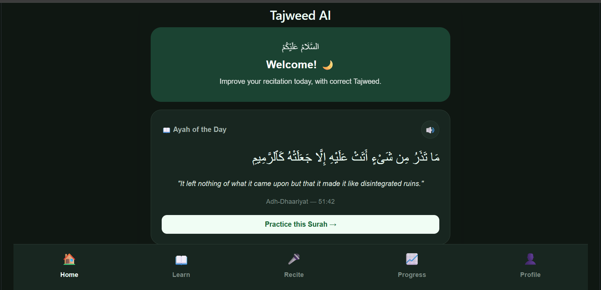
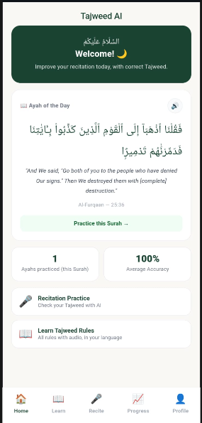
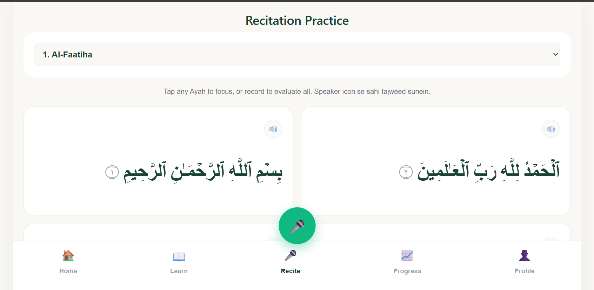
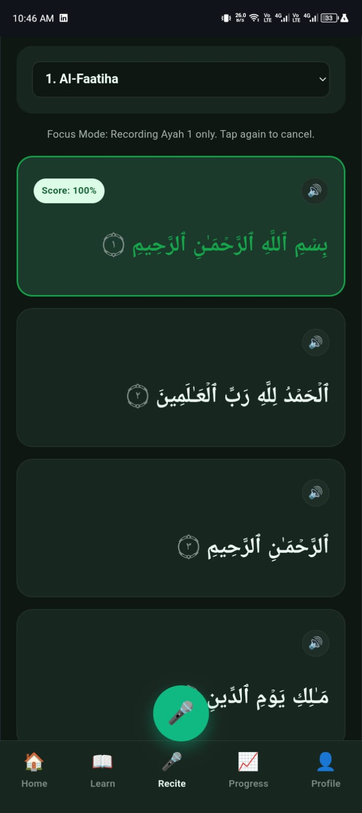
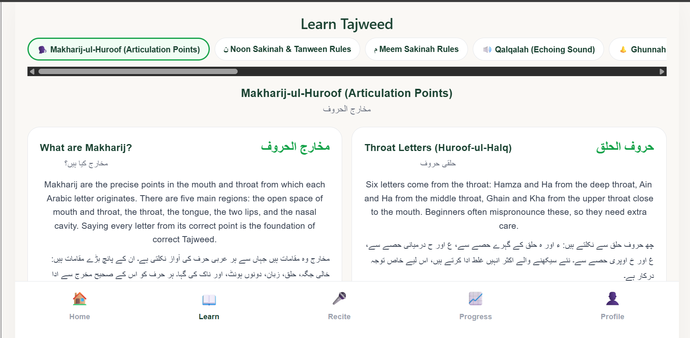
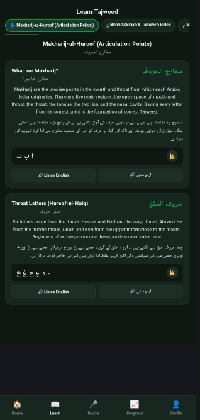
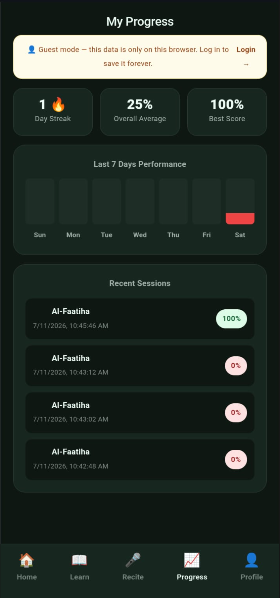
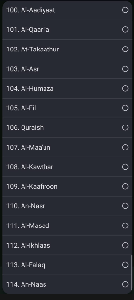
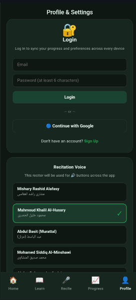
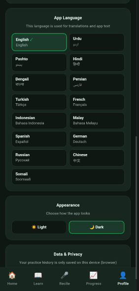

<div align="center">

# 📖 Quran Tajweed AI

### An AI-Powered Quran Recitation Checker with Real-Time Tajweed Feedback

Recite • Get Corrected • Learn • Track Your Progress

<p>


</p>

</div>

---

## 📖 Overview

**Quran Tajweed AI** is an intelligent, app-like recitation companion that listens to a user reciting the Qur'an, transcribes it using AI speech recognition, and instantly highlights which words were recited correctly and which need correction — powered by a custom Tajweed verification algorithm.

The application is built on a **modern, fully decoupled architecture**, with an independent React single-page frontend and a Python FastAPI backend, connected through a clean REST API. Instead of maintaining a static internal database of Quranic text, the app pulls verified Uthmani-script Ayahs live from the AlQuran.cloud API, making all 114 Surahs instantly available.

---

## 🚀 Key Highlights

| | | |
|---|---|---|
| ✅ AI-Powered Recitation Checking | ✅ Word-by-Word Tajweed Feedback | ✅ Focus Mode for Single-Ayah Practice |
| ✅ Native Arabic Text-to-Speech | ✅ Live Quranic Database (114 Surahs) | ✅ Gamified Progress Tracking |
| ✅ App-Like Tabbed Navigation | ✅ Glassmorphism Feedback Modal | ✅ Decoupled React + FastAPI Architecture |

---

## 📸 Project Preview

### 🏠 Home



### 🎙 Recite & Tajweed Checking



### 📚 Tajweed Rules & Learning



### 📈 Progress Tracking


### 📜 Surah Selection


### ⚙️ Profile & App Settings



---

## 🏗 System Architecture

Quran Tajweed AI is built on a **modern, decoupled architecture** — the frontend and backend operate completely independently and communicate purely through a REST API.

```
                     User (Browser / Mobile)
                              │
                              ▼
                    React SPA Frontend
           (MediaRecorder API + Web Speech API)
                              │
                        Axios / Fetch
                    (FormData → Audio Blob)
                              │
                              ▼
                  FastAPI Backend (Uvicorn)
                              │
                ┌─────────────┼──────────────┐
                │                            │
                ▼                            ▼
        Groq API                    AlQuran.cloud API
     (whisper-large-v3)             (Uthmani Script Text)
                │
                ▼
     Transcribed Text → Frontend
                │
                ▼
   Tajweed Verification Algorithm
      (Diacritic Stripping + Word Matching)
                │
                ▼
     Word-Level Feedback + Scoring
```

---

## 🛠 Technology Stack

### Frontend (Client-Side)

| Technology | Purpose |
|---|---|
| React.js | Single Page Application architecture |
| React Hooks (`useState`, `useEffect`, `useRef`) | Global and local state management — no Redux |
| HTML5 MediaRecorder API | Raw audio capture from browser/mobile microphone |
| Web Speech API (`SpeechSynthesisUtterance`) | Native Arabic (`ar-SA`) text-to-speech for pronunciation examples |
| CSS-in-JS + Keyframe Animations | Inline styling with `SlideUp`, `PopIn`, and `Pulse` animations |

### Backend (Server-Side)

| Technology | Purpose |
|---|---|
| Python 3 | Core backend language |
| FastAPI | High-performance asynchronous REST API framework |
| Uvicorn | ASGI web server |
| python-dotenv | Secure environment variable / API key injection |
| CORS Middleware | Cross-origin resource sharing |

### AI & Third-Party APIs

| Service | Purpose |
|---|---|
| Groq API — `whisper-large-v3` | Speech-to-text transcription of user recitations |
| AlQuran.cloud REST API | Verified Uthmani-script Quranic text, all 114 Surahs |

---

## 🎯 Core Features

### 🏠 Home
Landing tab with quick access to Surah browsing and app navigation.

### 🎙 Recite (AI Tajweed Checking)
- Tap the mic to record recitation directly in the browser
- Audio is transcribed via Groq's Whisper model
- Word-by-word comparison against the original Ayah
- **Correct words** highlighted in green (`#16A34A`)
- **Incorrect words** highlighted in red (`#EF4444`)
- Real-time accuracy percentage calculation

### 🎯 Focus Mode
Tap any specific Ayah to lock the app into a focused evaluation state — the AI checks only that tapped Ayah instead of the entire recitation.

### 📚 Learn
Tajweed rules and lessons; marking a lesson as learned instantly rewards points and updates progress.

### 📈 Progress
Tracks points, streaks, and lessons completed — all reflected live across the Progress and Home tabs.

### ⚙️ Profile & Settings
User profile management and app-wide settings/configuration.

---

## 🔄 Core System Flow

### A. Initialization Flow
1. User opens the app.
2. A `useEffect` hook fetches the list of Surahs from the AlQuran.cloud API and stores it in dropdown state.
3. Surah 1 is selected by default, with its Arabic text converted into a word-level array of objects and rendered on screen.

### B. Audio Processing Flow
1. User taps the mic button (🎤) — the MediaRecorder API requests microphone access and starts buffering audio chunks.
2. On stop, the chunks are merged into a single `.wav` Blob.
3. The Blob is sent via `FormData` to the FastAPI backend's `/api/analyze-audio` endpoint.
4. FastAPI temporarily saves the audio file on the server using `shutil`.

### C. AI Analysis Flow
1. FastAPI forwards the saved audio to the Groq API (Whisper).
2. Whisper is called with `language="ar"` and `response_format="json"` to ensure Arabic-only transcription.
3. Groq returns the transcribed text; the server deletes the temporary file and sends the text back to React.

### D. Tajweed Verification Algorithm (Frontend)
1. **Diacritic Stripping** — a custom `normalizeArabic()` regex function strips harakat (diacritics) from both the expected and spoken text before comparison, since AI-transcribed text is plain Arabic while the source Quranic text includes zabar/zer/pesh.
2. **Comparison** — checks whether each spoken word exists in the expected word array.
3. **Scoring & Highlighting** — matched words turn green ("correct"), unmatched words turn red ("incorrect"), and an overall accuracy percentage is calculated from the total word count.

### E. Feedback & Error Handling Flow
1. `sessionFeedback` state is updated with the results.
2. A Glassmorphism modal pops up with the session summary.
3. Incorrectly recited words are filtered and prominently displayed in a "Tajweed Corrections" block.

---

## 🏆 State & Progression Logic (Gamification)

- A global `userStats` object tracks **Points**, **Streak**, and **Lessons Completed**.
- Marking a lesson as learned in the Learn tab instantly adds **+50 points** and **+1 lesson**, reflected immediately across the Progress and Home tabs.

---

## 🔄 Major Architectural Migrations

The project went through several key migrations to scale properly:

### 1. Database Migration — Firebase → REST API
- **Phase 1:** Surah Al-Fatihah's text was initially stored manually in Firebase Firestore.
- **Migration:** Firebase was removed in favor of the AlQuran.cloud API, eliminating database maintenance overhead and instantly unlocking all 114 Surahs and their Ayahs dynamically.

### 2. UI/UX Transition — Single Page → Tabbed App
- **Phase 1:** A basic scrollable page with a single record button.
- **Migration:** To meet premium UI/UX design standards, the app was restructured into an "app-like" experience with a bottom navigation bar, dividing screens into **Home, Learn, Recite, Progress,** and **Profile** tabs.

### 3. Evaluation Logic Upgrade — Basic → Hybrid Focus Mode
- **Phase 1:** The AI listened to the entire audio recording with no way to check a specific Ayah.
- **Migration:** "Focus Mode" was introduced — tapping a specific Ayah locks the app state so the AI evaluates only that Ayah's word array.

---

## 📂 Project Structure

```
Quran-AI/
│
├── assets/
│   ├── AllSurah_Mobole.png
│   ├── App_Settings_Mobile.png
│   ├── Home_Desktop.png
│   ├── Light_Home_Mobile.png
│   ├── Profile_Mobile.png
│   ├── Progress_Mobile.png
│   ├── Recite_Desktop.png
│   ├── Recite_Mobile.jpeg
│   ├── Rules_Desktop.png
│   └── Rules_Mobile.png
│
├── quran-tajweed/              # React frontend
│   ├── src/
│   └── package.json
│
├── quran-tajweed-backend/      # FastAPI backend
│   ├── main.py
│   └── requirements.txt
│
├── .gitignore
└── README.md
```

---

## 🚀 Getting Started

**1. Clone the repository**
```bash
git clone https://github.com/abdulqadeer-44/Quran-AI.git
cd Quran-AI
```

**2. Set up the backend**
```bash
cd quran-tajweed-backend
pip install -r requirements.txt
```

Create a `.env` file in the backend directory:
```env
GROQ_API_KEY=your_groq_api_key_here
```

Start the FastAPI server:
```bash
uvicorn main:app --reload
```

**3. Set up the frontend**
```bash
cd ../quran-tajweed
npm install
npm run dev
```

---

## 📡 Backend API Reference

| Method | Endpoint | Description |
|---|---|---|
| `POST` | `/api/analyze-audio` | Accepts recorded audio (FormData), transcribes it via Groq Whisper, and returns the transcribed Arabic text |

---

## 🔐 Security & Configuration

- API keys (Groq, etc.) are securely managed via `python-dotenv` and never hardcoded
- CORS Middleware configured for safe cross-origin communication between frontend and backend
- Temporary audio files are deleted from the server immediately after transcription

---

## 📈 Performance Highlights

- Fully asynchronous backend via FastAPI for fast, non-blocking audio analysis
- Live Quranic text fetched on demand — no local database to maintain
- Lightweight in-browser TTS using the native Web Speech API (zero additional API cost)
- Smooth animated tab transitions for an app-like user experience

---

## ⭐ Roadmap

- Expand Tajweed rule detection beyond word matching (Makharij analysis)
- Add reciter-style comparison and detailed pronunciation scoring
- Offline mode for previously fetched Surahs
- Multi-language UI support
- Leaderboards and social progress sharing

---

## 🤝 Contributing

Contributions are always welcome!

1. Fork the repository
2. Create a new feature branch
3. Commit your changes
4. Push your branch
5. Open a pull request

```bash
git checkout -b feature/new-feature
git commit -m "Add new feature"
git push origin feature/new-feature
```

---

<div align="center">

## 👨‍💻 Author

**Abdul Qadeer Sikandar**
Software Engineering Student · University of Gujrat
Full Stack Web Developer

[💼 LinkedIn](https://www.linkedin.com/in/abdulqadeersikandar) · [💻 GitHub](https://github.com/abdulqadeersikandar-pixel)

---

### 🌟 Support

If you found this project useful, please consider ⭐ starring the repository, 🍴 forking it, and 📢 sharing it with others.

### 📜 License

Licensed under the **MIT License** — free to use, modify, and distribute for educational purposes.

**Made with ❤️ by Abdul Qadeer Sikandar**

</div>
